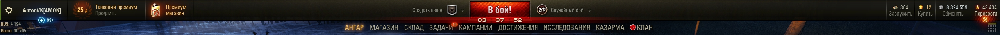

# WoT-mod-hangarClockCalculator

**Модификация для игры [World of Tanks](https://tanki.su/) : цифровые часы, аналоговые часы и калькулятор в ангаре (с конфигом).**

[Тема на официальном форуме игры](http://forum.tanki.su/index.php?/topic/1241669-1201x-цифровые-часы-аналоговые-часы-и-калькулятор/)

---

## Цифровые часы в ангаре с датой и днём недели

* Часы в формате HH:mm:ss
* Возможность отображения времени в 12-часовом формате исчисления
* Возможность отображения времени, даты и дня недели в свободном формате
* Возможность отображения мигающего двоеточия на часах
* Возможность использования фона для даты, часов и дня недели
* Возможность свободного размещения элементов и персонализации оформления
* Возможность локализации названий месяцев и дней недели

## Аналоговые часы в ангаре

## Калькулятор в ангаре

* Базовые арифметические действия: сложение, вычитание, умножение, деление
* Арифметические действия с процентами
* Арифметические действия с отрицательными числами и числами с точкой
* Ввод как при помощи мыши, так и с клавиатуры
* История последних произведённых действий
* Алгоритм работы, как у стандартного калькулятора Windows
* Оформление в стиле игрового клиента World of Tanks

Алгоритм работы калькулятора практически полностью аналогичен алгоритму работы стандартного калькулятора Windows 7 — Windows 8.1. При вводе с клавиатуры могут быть использованы клавиши с обозначением цифр и арифметических действий.

## Персонализация при помощи конфигурационного файла

В конфигурационном файле можно задать координаты позиционирования элементов (часы и кнопка вызова калькулятора),  а также размер и цвет шрифта, параметры визуальных эффектов для текста часов и некоторые другие.
 
Формат вывода даты — свободный, в зависимости от предпочтений. Именование дней недели и месяцев — тоже (таким образом, названия можно локализовывать, либо использовать цифровую нумерацию и т.п.).
 
При форматировании даты рекомендуется ориентироваться на региональные настройки.

---

### Установка

1. Распаковать архив в любое удобное место
1. Cкопировать содержимое директории архива mods в директорию **<путь установки игры>\World_of_Tanks\mods**
1. Запустить игровой клиент

### Настройка

После установки может понадобиться внести изменения в конфигурационный файл. Если по каким–либо причинам Вы не хотите пользоваться конфигурационным файлом, то можно его просто переименовать или удалить. В этом случае будут применены значения параметров по умолчанию.

 
Конфигурационные файлы — **configHangarClock.xml**, **configHangarCalculator.xml**, **configHangarClockAnalog.xml** расположены в директории  **<путь установки игры>\World_of_Tanks\mods\configs\AntonVK**
 
Пояснение параметров конфигурационного файла приведено в самом файле.
 
Вносить изменения в конфигурационный файл можно в режиме «реального времени», не закрывая окно игрового клиента. Например:

* открываете файл в редакторе Notepad++
* запускаете клиент
* смотрите, как отображаются элементы
* сворачиваете окно клиента
* редактируете параметры по своему вкусу
* сохраняете файл
* разворачиваете окно клиента
* смотрите результаты изменений
 
Рекомендуется использовать для редактирования свободно распространяемую программу Notepad++

### Примеры конфигураций

В архиве приводятся примеры базовых конфигураций со скриншотами. Вы можете настроить параметры по своему вкусу, основываясь на данных конфигурациях.

**config-default** (расположение элементов в случае отсутствия конфигурационных файлов)

**config-v1.1**

**config-v1.2**

**config-v2.1**

**config-v2.2**

